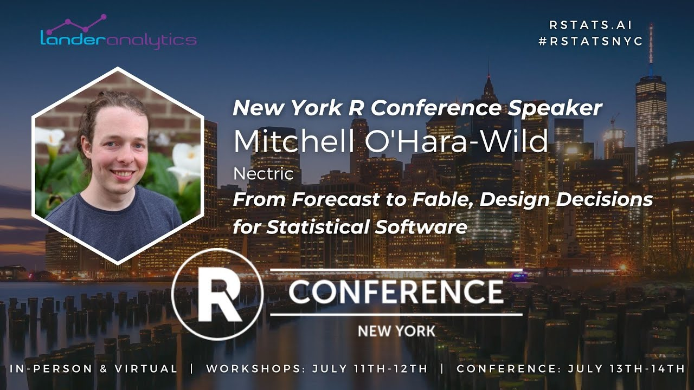

<!-- README.md is generated from README.Rmd. Please edit that file -->

```{r, include = FALSE}
knitr::opts_chunk$set(
  collapse = TRUE,
  comment = "#>"
)
```

# NYR2023: From forecast to fable, design decisions for statistical software.

<!-- badges: start -->
<!-- badges: end -->

Slides and notes for a talk at the 2023 New York R (13-14th July 2023) in Manhattan, New York USA.

<!-- A recording of this presentation is available on YouTube here: <https://www.youtube.com/watch?v=> -->

<!-- [](https://www.youtube.com/watch?v=) -->

#### Abstract

TBC

#### Structure (WIP)

* Making R packages
* Design principles: flexibility, extensibility, generality
* Creating a component
* Embracing tidyverse design
* Specific comparisons between forecast and fable

### Format

20 minute talk.
